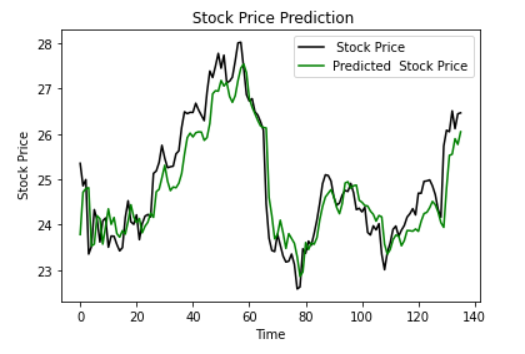

# LSTM-CNN_Stock
Stock market prediction by using CNN-LSTM neural network. 
full explanation is available at [1]. 
this method uses normalization on whole data instead of window size normalization which paper proposes.
using more features makes an improvement to the accuracy as the following pictures show the difference between using 1 and 6 features in apple stock prediction:\

<a> Predicted vs real price after 200 epoch using 1 feature </a>

<a>Predicted vs real price after 200 epoch using 6 feature </a>
## Reference 
[1] Eapen, J., Bein, D., & Verma, A. (2019). Novel deep learning model with cnn
and bi-directional lstm for improved stock market index prediction. In 2019
IEEE 9th Annual Computing and Communication Workshop and Conference
(CCWC) (pp. 0264{0270). doi:10.1109/CCWC.2019.8666592.
